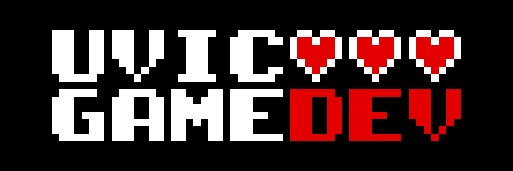

# PassTheGame_2024
 

UVGD's First Pass the Game Challenge.

Feb 7th - April 10th 2024 

Each team was given the project on Wednesday, and passed it along the following Wednesday

The project was revealed on April 10th to the club and UVIC faculty.

## BUILDING INSTRUCTIONS
Made in Godot 4.2.1 : https://godotengine.org/ 

Simply open the project in Godot and run the project.

You can also export it how you wish. Basic knowledge of exporting Godot projects is reccomended.

## Winning
Collect at least 20 cards and find the exit circle.

# Credits
## Team list:
- Avery / Matthew / Elliott
- Alex / Ky / Larry
- Josh / Christian M.
- Grace / Auri
- Lachlann / Nathan / Matt / Zac
- Rowan / Brendan W.
- NONE
- Colton
- Brendan C. / Shelby / Victoria / Martin

## Organization
- Brendan Ciccone
### Special Thanks
- Toby Murray

# RULES
The rule set used for every team.
## Remember the rule of improv: "Yes, and..."
- You have 6 hours to work (each individual)
- Do not Delete
- Do not communicate to the next teams what they will be getting
## Temporary Asset Convention:
- any file (ANY FILE) that is meant to be temporary shall be denoted as such:
- character_sprites_temp.png
- water_temp.gdshader
- camera_script_temp.gd
- block_temp.tscn

- If you don't do this, someone can't replace your work.

## Commenting
- Don't write comments explaining stuff that doesnt exist...
